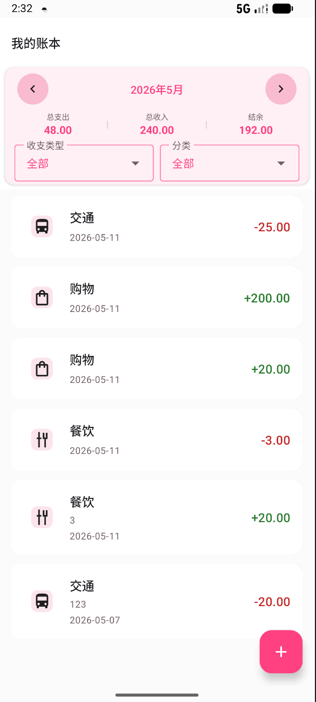
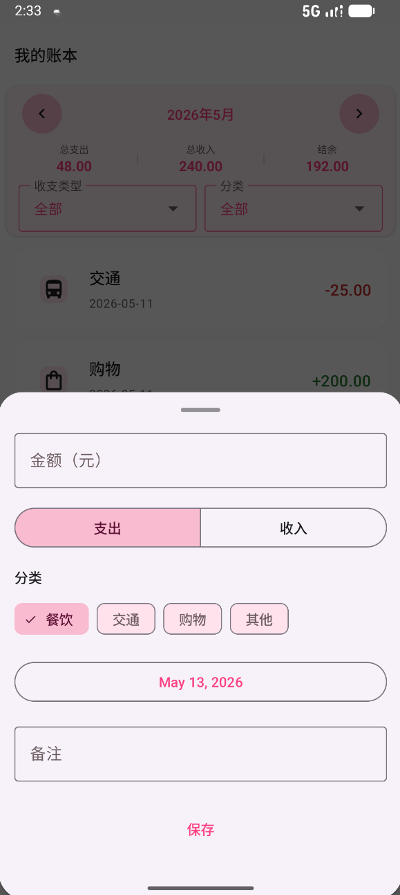
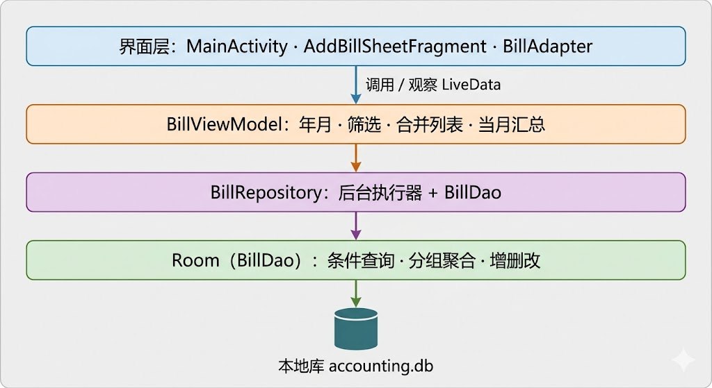

# 个人记账 Android 应用 —— 中期检查汇报

张馨月 2022012199

## 一、摘要

本项目为基于 `Android` 的日常收支记账应用，界面遵循 Material 第三代规范。目前已完成账本主界面、记账半屏弹层、账单列表与筛选，`Room` 本地持久存盘、按月查看与月度收支汇总等基本功能。下一阶段将重点实现统计展示页面，优化用户交互体验。

## 二、主要界面展示

| 主页面 | 输入 |
| :-----: | :-----: |
|  |  |

## 三、项目核心关键页面实现方案

### 1. 账本总览（主交互界面）

核心组件：`MainActivity` + `activity_main.xml`

UI 架构与交互：

- 布局设计： 采用 `CoordinatorLayout` 协作布局。主区域由 Material Design 风格的圆角卡片（`Header`）与账单列表组成，右下角集成悬浮操作按钮（`FAB`）触发记账。
- 状态管理： 顶部 `Header` 维护 `BillViewModel` 中的 `yyyy-MM` 状态。支持左右切换月份或通过 `DatePicker` 精准跳转；实时汇总展示当月「支出、收入、结余」三大核心指标。
- 数据过滤： 列表支持基于枚举类型（收/支）及具体分类的二次过滤。设计约定： 顶部汇总数据始终锚定当月全量账单，筛选操作仅作用于列表展示，确保用户对全局财务状况有稳定预期。
- 批量操作： 列表支持长按进入多选模式，底部动态浮出全选/删除操作条，提升大批量账单的处理效率。

### 2. 记账 / 编辑详情（半屏交互）

核心组件：`AddBillSheetFragment` + `layout_add_bill`

功能特性：

- 组件形态： 基于 `BottomSheetDialogFragment` 实现，覆写 `Material` 主题以实现流畅的半屏升降交互。
- 输入校验： 针对金额输入通过 `InputFilter` 限制格式，并在提交流程中加入逻辑校验（非空且必须大于零），确保落库数据的有效性。
- 维度选择：
类型： 通过 `Segmented Button`（分段按钮）切换收支状态。
分类： 采用 `ChipGroup` 展现分类标签，通过视觉聚焦引导用户快速标记。
- 时间： 调用 `MaterialDatePicker` 选择日期，并将时间戳统一标准化为「当日正午」，规避时区及跨日计算带来的统计误差。
- 数据协同： 支持新建与编辑双模式传参。操作完成后通过 `BillRepository` 执行异步持久化（`Insert`/`Update`），并利用 `Snackbar` 提供即时反馈，随后自动销毁弹窗。

### 3. 账单明细列表（数据驱动层）

核心组件：`BillAdapter` + `ListAdapter` + `MediatorLiveData`

技术实现：
- 高效刷新： 继承 `ListAdapter` 并实现 `DiffUtil.ItemCallback`，通过差异化算法实现局部刷新，确保长列表操作的性能与动画流畅度。
- 响应式流： 核心逻辑采用 `MediatorLiveData` 监听数据库原始记录及筛选条件（类型、分类）的变化。当任何维度发生变动时，自动计算并分发合并后的展示列表。
- 手势交互：
侧滑删除： 集成 `ItemTouchHelper` 实现侧滑逻辑，并伴随二次确认弹窗防止误删。
冲突优化： 针对纵滑刷新与横滑删除的手势争抢，优化了滑动阈值与轨道收回逻辑，提升操作的确定感。

## 四、项目主要模块设计（前端、后端与交互）

### 前端

1. `MainActivity`：装配界面、取得并持有 `BillViewModel`；给列表设布局管理器与条目动画；注册对多路可观察数据的监听以刷新头部与列表；处理换月、分类多选、删除与批量删除对话框、多选底栏显隐；悬浮按钮打开 `AddBillSheetFragment`。另处理启动画面结束后的主题切换，以及贴边绘制时给根布局补系统栏内边距。

2. `AddBillSheetFragment`：只做表单与单笔保存，经共享的 `BillViewModel` 调用仓库，不直接打开数据库。

3. `BillAdapter`：封装侧滑删除轨道、多选状态、行内绑定，以及「收起全部侧滑」的静态帮助，压缩主界面体积。

4. 资源：主题与夜间色值、弹层圆角、字符串与尺寸集中在 `values` 与布局里，遵循 Material 第三代视觉规范。

### 后端

层次自上而下为：

1. 实体 `Bill`：`Room` 注解映射表 `bills`，含自增主键、金额、类型（0 支出 / 1 收入）、分类名、日期毫秒、备注。

2. 数据库单例 `AccountingDatabase`：指向本地文件 `accounting.db`；当前为开发方便，库结构大改时允许整库重建。

3. 访问接口 `BillDao`：全表观察、按「年-月」字符串筛当月列表、增删改；另有 `observeMonthlySummaries`，按自然月分组并对支出、收入分别条件求和，供趋势或统计扩展。

4. 仓库 `BillRepository`：对外提供 `observeBillsForYearMonth`、`observeMonthlySummaries`、`observeAllBills`，以及 `insert`、`update`、`delete` 单条与 `delete` 列表（循环删多条）；写操作在单线程执行器里跑，完成时用主线程处理器回调界面提示。

### 模块交互

## 五、当前困难、潜在问题与应对措施

（1）当前主要困难  

1.手势冲突。列表在同一区域既要纵向滑动浏览，又要横向滑出删除、长按进入多选，有时会出现误触或与系统推荐的滑动阈值冲突。目前正通过区分滑动方向、滑动距离、滚动时自动收起侧滑行等方式缓和；后续若仍有不顺手的情况，再考虑弱化某一种手势强度或改为「仅用菜单 / 仅用点击」一类的折中。

2.真机上的响应式与适配问题。异形屏、安全区（刘海与底部手势条）、不同分辨率下，可能出现顶栏与内容被挡、记账弹层被键盘顶住或可点区域偏小等现象。当前采用模拟器和真机结合调试。

（2）后续可能的风险与粗略预案  

1. 手势冲突。统计页若引入横向分页或图表拖拽，易与主页列表的侧滑、纵滑混用产生误触。预案：统计区用明确的换月控件或 `ViewPager2` 分区，避免在饼图热区叠复杂手势；主页保留菜单删除等降级选项，真机上记录误触再调阈值。

2. 统计页面接入逻辑。不把统计逻辑塞进 `MainActivity`：独立界面，用导航或 `Intent` 传递 `yearMonth`，或共享视图模型对齐当前月；`DAO` 增补按类别聚合查询，`Repository` 暴露给统计专用视图模型订阅，避免重复拉整表；图表与领域数据做小对象适配，图表库换代时不涉及记账主流程。

3. 自定义分类的接入。现状为 `Bill.category` 字符串 + 界面写死 `Chip`；若要用户维护分类，需分类表与外键、`Migration` 迁移存量（按名称去重并回填 `id`），不使用长期破坏性迁移。改名 / 删类要明确历史账单展示策略。
